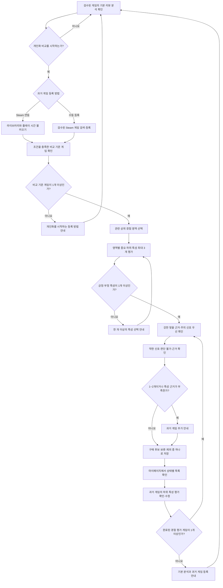

# NextQuest 대표 사용자 흐름

## 흐름의 목적

대표 사용자 흐름은 `기본 리뷰 분석 확인 → 과거 경험 입력 → 개인화 비교 → 구매 판단 저장`을 하나의 과정으로 연결한다. 개인화 조건을 충족하지 못한 사용자도 기본 분석을 이용할 수 있어야 한다.

## 1. 기본 리뷰 분석 확인

1. 사용자가 서비스에 접속한다.
2. 로그인하지 않아도 검수된 8개 게임 목록을 볼 수 있다.
3. 구매를 고민하는 게임을 선택한다.
4. 상위 경험 영역과 하위 특성별 기본 리뷰 분석, 실제 리뷰 근거를 확인한다.

이 단계에서는 사용자 취향을 추측하지 않는다. 게임 자체에서 반복적으로 언급되는 특성만 보여준다.

## 2. 과거 게임 등록

사용자가 개인화 비교를 선택하면 두 경로 중 하나로 과거 게임을 등록한다.

### Steam 연동

1. Steam 계정을 연결한다.
2. 공개된 라이브러리와 플레이 시간을 불러온다.
3. NextQuest가 검수한 소울라이크·인접 장르 목록과 대조한다.
4. 한국어 인터페이스와 충분한 플레이 시간 조건을 충족한 게임만 비교 기준 후보로 보여준다.

라이브러리가 비공개이거나 새 계정이라 목록을 불러오지 못하면 수동 등록 경로를 안내한다.

### 수동 등록

1. NextQuest가 검수한 Steam 등록 게임을 검색한다.
2. 플레이한 플랫폼과 플레이 시간 구간을 입력한다.
3. 한국어 인터페이스, 장르, 플레이 경험 조건을 충족한 게임만 비교 기준으로 등록한다.

수동 등록은 사용자의 실제 플레이 경험을 자기보고 방식으로 받는다. 자유 텍스트 게임 생성과 Steam 미등록 게임 등록은 허용하지 않는다.

## 3. 개인화 입력 가능 여부 확인

- 조건을 충족한 비교 기준 게임이 한 개 이상이면 평가 단계로 이동한다.
- 등록한 게임이 없으면 개인화를 시작하는 데 필요한 조건과 등록 방법을 안내한다.
- 추가 등록을 원하지 않으면 기본 리뷰 분석으로 돌아갈 수 있다.

서비스 전체를 차단하지 않고 과거 경험이 전혀 없을 때만 개인화 비교를 잠근다. 한 개 게임으로도 제한된 결과를 제공하며, 게임을 더 입력하면 반복되는 취향과 예외를 구분할 근거가 늘어난다고 안내한다.

## 4. 과거 경험 평가

1. 사용자가 충분히 플레이했고 선호한 경험이 많으며 그 이유와 아쉬웠던 점을 구체적으로 떠올릴 수 있는 비교 기준 게임을 선택한다.
2. 게임에서 자신에게 관련 있는 상위 경험 영역을 선택한다.
3. 선택한 상위 경험 영역 아래에서 중요한 하위 특성을 최대 3개까지 고른다.
4. 고른 하위 특성이 긍정적인 경험이었는지 부정적인 경험이었는지 구분한다.
5. 긍정·부정을 구분한 하위 특성이 한 개 이상이면 입력을 저장하고 해당 게임을 개인화 비교에 사용한다.

상위 경험 영역 전체를 채우도록 강제하지 않는다. 충분히 경험하지 않았거나 중요하지 않은 특성은 선택하지 않을 수 있으며, `판단 불가`는 사용자 취향 입력값이 아니라 비교 결과 상태로만 사용한다.

## 5. 개인화 비교 확인

1. 사용자가 검수된 분석 대상 게임을 선택한다.
2. 시스템이 저장된 리뷰 분석과 최신 사용자 취향을 비교한다.
3. 가장 강한 `맞을 근거`와 `주의 신호`를 먼저 함께 보여준다.
4. 상대적으로 약한 신호를 강도 순으로 이어서 보여준다.
5. 사용자에게 중요한 긍정·부정 특성이지만 리뷰 근거가 부족하거나 서로 충돌하면 별도의 `판단 불가` 목록으로 보여준다. 부정적으로 평가한 특성은 잠재적인 주의 항목임을 함께 알린다.
6. 결과 상태는 다음 의미를 가진다.
   - `맞을 근거`: 사용자가 좋았다고 평가한 경험과 후보 게임의 특성이 연결됨
   - `주의 신호`: 사용자가 아쉬웠다고 평가한 경험과 후보 게임의 특성이 연결됨
   - `판단 불가`: 관련 리뷰가 한 개 이상 있지만 결론을 뒷받침하기에 부족하거나 서로 충돌함
7. 사용자가 각 결과에 연결된 실제 리뷰 근거를 확인한다.
8. 비교 기준 게임이 1~2개이면 제한된 데이터로 만든 결과임을 항상 알린다. 3개 이상이어도 선택한 특성의 반복과 범위가 충분하지 않으면 같은 안내와 추가 입력 경로를 제공한다.

종합 적합도 점수는 제공하지 않는다. 특성별 결과가 전체 게임을 좋아할 가능성을 보장하는 것처럼 표현하지 않는다.

관련 리뷰가 한 개 이상 있지만 충분하지 않거나 서로 충돌할 때만 `판단 불가` 결과와 실제 근거를 함께 보여준다. 관련 리뷰가 없으면 개인화 결과를 만들지 않고 현재 분석에서 근거를 찾지 못했다고 안내한다. 비어 있는 결과 그룹은 숨기며, 모든 그룹이 비어 있으면 기본 리뷰 분석을 계속 제공한다.

## 6. 마이페이지에서 판단과 과거 경험 관리

1. 사용자가 게임을 `구매 후보`, `보류`, `제외` 중 하나로 저장한다.
2. 마이페이지에서 상태별 목록을 확인한다.
3. 사용자는 분석 결과와 관계없이 상태를 직접 변경할 수 있다.
4. 비교 기준으로 등록한 과거 게임과 하위 특성 평가를 확인할 수 있다.
5. 과거 경험 평가를 수정하면 개인화 결과는 최신 입력을 기준으로 다시 계산된다.

## 주요 예외 흐름

| 상황 | 처리 |
| --- | --- |
| Steam 라이브러리가 비공개임 | 수동 등록 경로 안내 |
| 새 Steam 계정이라 과거 게임이 없음 | 다른 플랫폼에서 플레이한 Steam 등록 게임 수동 등록 안내 |
| 비교 기준 게임이 없음 | 기본 분석은 허용하고 개인화를 시작하는 등록 방법 안내 |
| 비교 기준 게임이 1~2개임 | 제한된 결과를 제공하고 추가 입력의 이점과 경로를 항상 안내 |
| 비교 기준 게임이 3개 이상이지만 특성 근거가 부족함 | 제한된 결과를 제공하고 데이터 부족 안내 유지 |
| 긍정·부정을 구분한 하위 특성이 없음 | 경험 평가를 완료하지 않고 한 개 이상의 특성 선택 안내 |
| 검색한 게임이 검수 목록에 없음 | 지원하지 않는 이유와 현재 지원 범위 안내 |
| 관련 리뷰가 한 개 이상이지만 부족하거나 충돌함 | 해당 특성을 `판단 불가`로 표시하고 실제 근거 연결 |
| 관련 리뷰를 찾지 못함 | 개인화 결과를 만들지 않고 근거 없음 안내 |
| 맞을 근거 또는 주의 신호 중 한쪽이 비어 있음 | 비어 있는 그룹을 숨기고 존재하는 그룹부터 표시 |
| 모든 개인화 결과 그룹이 비어 있음 | 현재 근거로 비교할 수 없다고 안내하고 기본 리뷰 분석 제공 |
| 과거 경험 평가가 수정됨 | 최소 입력을 다시 검증하고 유효하면 최신 입력으로 개인화 결과 재계산 |
| 수정 후 완료된 비교 기준 게임이 없음 | 개인화 결과를 제공하지 않고 기본 리뷰 분석과 등록 안내 제공 |

## 관련 문서

- [프로젝트 컨텍스트](../project-context.md)
- [MVP 범위](scope.md)
- [개발 계획](development-plan.md)
