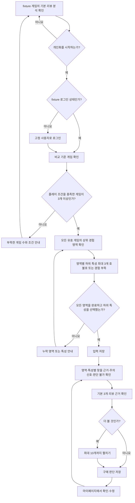

# NextQuest 내부 프로토타입 사용자 흐름

## 흐름의 목적

대표 흐름은 `기본 리뷰 분석 → fixture 로그인 → 과거 경험 입력 → 개인화 비교 → 구매 판단 저장`을 연결한다. 외부 서비스 없이도 사용자가 리뷰 근거와 개인화 결과를 이해하고 구매 판단에 활용하는지 검증한다.

## 1. 기본 리뷰 분석 확인

1. 사용자가 서비스에 접속한다.
2. 로그인하지 않아도 fixture 게임 목록을 볼 수 있다.
3. 구매를 고민하는 게임을 선택한다.
4. 상위 경험 영역과 구체적인 하위 특성별 기본 리뷰 분석을 확인한다.
5. 분석 항목에 연결된 실제 리뷰 근거를 확인한다.

기본 분석은 게임 리뷰에서 반복된 특성을 설명하며 사용자 취향을 추측하지 않는다.

## 2. fixture 로그인

1. 사용자가 개인화 비교를 시작한다.
2. 로그인하지 않았다면 고정된 fixture 사용자로 로그인한다.
3. 로그인 후 개인화 입력과 저장 기능을 사용할 수 있다.

이 로그인은 화면 흐름과 접근 제어를 검증하기 위한 모의 동작이다. 실제 계정, 비밀번호, OAuth와 서버 세션을 사용하지 않는다.

## 3. 비교 기준 게임 확인

1. fixture 라이브러리에서 검수된 소울라이크·인접 장르 게임을 확인한다.
2. 각 게임의 플레이 시간이 해당 게임의 최소 기준을 충족하는지 확인한다.
3. 사용자가 해당 게임을 취향을 평가할 만큼 충분히 플레이했다고 확인한다.
4. 두 조건을 모두 충족한 게임을 비교 기준 게임으로 인정한다.

플레이한 플랫폼과 게임 언어, 한국어 지원 여부는 자격에 영향을 주지 않는다. 유효한 게임이 3개 미만이면 개인화 비교만 잠그고 부족한 게임 수와 조건을 안내한다. 기본 리뷰 분석은 계속 이용할 수 있다.

## 4. 과거 경험 평가

1. 사용자는 조건을 충족한 모든 비교 기준 게임을 순서대로 평가한다.
2. 각 게임에서 설정된 모든 상위 경험 영역을 순서대로 확인한다.
3. 충분히 경험한 영역에서는 자신에게 중요했던 하위 특성을 최대 3개까지 고른다.
4. 선택한 하위 특성마다 `좋았음` 또는 `아쉬웠음`을 표시한다. 같은 영역에 두 방향의 특성을 함께 선택할 수 있다.
5. 충분히 경험하지 않은 영역은 `경험 부족`으로 표시한다.
6. 진행률과 아직 확인하지 않은 영역, 하위 특성을 선택하지 않은 경험 영역을 확인한다.
7. 모든 상위 영역을 처리하고 게임 전체에서 하위 특성 한 개 이상에 호불호를 표시하면 저장할 수 있다.

`경험 부족`은 상위 영역 확인 완료에는 포함하지만 해당 영역의 취향 계산에는 사용하지 않는다. 일부 영역이 `경험 부족`이어도 게임별 플레이 조건과 게임 평가 완료 조건을 충족했다면 최소 3개 게임 수에는 포함한다.

작성 중인 입력은 `localStorage`에 자동 저장한다. 사용자가 페이지를 새로고침하거나 다시 방문하면 초안을 복구한다. 저장 버튼을 누르면 완료 상태를 로컬에 기록하며 서버로 전송하지 않는다.

## 5. 개인화 계산 범위

- 조건을 충족하고 모든 상위 영역 확인을 완료한 모든 비교 기준 게임을 사용한다.
- 사용자가 계산에 사용할 3개 게임만 따로 선택하지 않는다.
- 사용자가 직접 선택하고 `좋았음` 또는 `아쉬웠음`을 표시한 하위 특성만 취향 방향의 근거로 사용한다.
- `경험 부족`, 특성 미발견과 특성 미선택은 부정 신호로 해석하지 않는다.
- 특성의 분포 범위와 사용자의 선호 일관성을 별도로 계산한다.
- 한 게임에서만 선택된 특성은 반복 취향이 아니라 잠정적인 근거로 취급한다.

## 6. 개인화 결과 확인

1. 사용자가 분석 대상 게임을 선택한다.
2. 시스템이 저장된 사용자 하위 특성 평가와 후보 게임의 검수된 리뷰 특성을 비교한다.
3. 상위 경험 영역과 하위 특성별로 다음 결과를 보여준다.
   - `맞을 근거`: 사용자가 과거에 좋아한 특성과 후보 게임의 특성이 연결됨
   - `주의 신호`: 사용자가 과거에 아쉬워한 특성과 후보 게임의 특성이 연결됨
   - `판단 불가`: 사용자 평가, 비교 가능한 특성 또는 리뷰 근거가 부족하거나 서로 충돌함
4. 한 상위 영역에 맞을 근거와 주의 신호가 모두 있으면 함께 보여준다.
5. 각 결과에서 대표 리뷰 근거 3개를 먼저 보여준다.
6. 더보기를 선택하면 서로 다른 관점을 포함해 최대 10개까지 보여준다.

영어 리뷰 근거는 검수한 한국어 번역을 먼저 보여주고 원문도 함께 확인할 수 있게 한다. 종합 적합도 점수는 제공하지 않으며, 결과가 게임 전체를 좋아할 가능성을 보장한다고 표현하지 않는다.

## 7. 구매 판단과 과거 경험 관리

1. 사용자가 게임을 `구매 후보`, `보류`, `제외` 중 하나로 저장한다.
2. 마이페이지에서 상태별 목록을 확인한다.
3. 비교 기준 게임의 상위 영역과 하위 특성 평가를 확인하고 수정한다.
4. 수정한 평가를 저장하면 개인화 결과를 다시 계산한다.
5. 유효한 비교 게임이 3개 미만이 되면 기존 결과 대신 필요한 조건을 안내한다.

모든 상태는 같은 브라우저의 `localStorage`에만 유지된다. 브라우저 데이터가 삭제되거나 다른 기기에서 접속하면 복구되지 않는다.

## 주요 예외 흐름

| 상황 | 처리 |
| --- | --- |
| 개인화를 로그인 없이 시작함 | fixture 로그인 화면으로 이동 |
| 유효한 비교 기준 게임이 3개 미만임 | 기본 분석은 허용하고 개인화만 잠금 |
| 게임별 최소 플레이 시간은 충족했지만 충분히 플레이하지 않았다고 답함 | 비교 기준 게임에서 제외 |
| 확인하지 않은 상위 경험 영역이 있음 | 저장을 막고 누락 영역과 진행률 안내 |
| 경험한 영역에서 하위 특성을 선택하지 않음 | 저장을 막고 한 개 이상의 중요 특성 선택 안내 |
| 일부 영역을 `경험 부족`으로 응답함 | 영역 확인 완료로 인정하고 해당 영역 계산에서 제외 |
| 같은 영역에 좋아한 특성과 아쉬운 특성이 있음 | 두 방향을 모두 저장하고 결과에서도 함께 비교 |
| 비교 특성이나 리뷰 근거가 부족하거나 충돌함 | 해당 하위 특성을 `판단 불가`로 표시 |
| 영어 근거의 번역이 검수되지 않음 | 사용자 화면에 노출하지 않음 |
| 새로고침함 | 작성 중 초안과 저장 상태를 `localStorage`에서 복구 |
| 다른 기기에서 접속함 | 동기화하지 않고 새 로컬 상태로 시작 |

## 관련 문서

- [프로젝트 컨텍스트](../project-context.md)
- [MVP 범위](scope.md)
- [리뷰 분석 정책](review-analysis.md)
- [개발 계획](development-plan.md)
