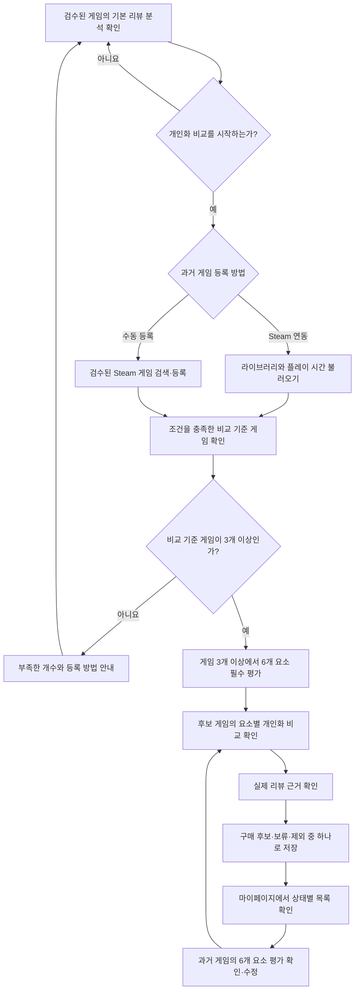

# NextQuest 대표 사용자 흐름

## 흐름의 목적

대표 사용자 흐름은 `기본 리뷰 분석 확인 → 과거 경험 입력 → 개인화 비교 → 구매 판단 저장`을 하나의 과정으로 연결한다. 개인화 조건을 충족하지 못한 사용자도 기본 분석을 이용할 수 있어야 한다.

## 1. 기본 리뷰 분석 확인

1. 사용자가 서비스에 접속한다.
2. 로그인하지 않아도 검수된 8개 게임 목록을 볼 수 있다.
3. 구매를 고민하는 게임을 선택한다.
4. 6개 경험 요소별 기본 리뷰 분석과 실제 리뷰 근거를 확인한다.

이 단계에서는 사용자 취향을 추측하지 않는다. 게임 자체에서 반복적으로 언급되는 특성만 보여준다.

## 2. 과거 게임 등록

사용자가 개인화 비교를 선택하면 두 경로 중 하나로 과거 게임을 등록한다.

### Steam 연동

1. Steam 계정을 연결한다.
2. 공개된 라이브러리와 플레이 시간을 불러온다.
3. NextQuest가 검수한 소울라이크·인접 장르 목록과 대조한다.
4. 한국어 자막과 충분한 플레이 시간 조건을 충족한 게임만 비교 기준 후보로 보여준다.

라이브러리가 비공개이거나 새 계정이라 목록을 불러오지 못하면 수동 등록 경로를 안내한다.

### 수동 등록

1. NextQuest가 검수한 Steam 등록 게임을 검색한다.
2. 플레이한 플랫폼과 플레이 시간 구간을 입력한다.
3. 한국어 자막, 장르, 플레이 경험 조건을 충족한 게임만 비교 기준으로 등록한다.

수동 등록은 사용자의 실제 플레이 경험을 자기보고 방식으로 받는다. 자유 텍스트 게임 생성과 Steam 미등록 게임 등록은 허용하지 않는다.

## 3. 개인화 조건 확인

- 조건을 충족한 비교 기준 게임이 3개 이상이면 평가 단계로 이동한다.
- 1~2개이면 현재 등록 수와 추가로 필요한 개수를 알려준다.
- 0개이거나 추가 등록을 원하지 않으면 기본 리뷰 분석으로 돌아갈 수 있다.

서비스 전체를 차단하지 않고 개인화 비교만 잠근다. 사용자가 자격 미달처럼 느끼지 않도록 부족한 데이터와 해결 방법을 구체적으로 안내한다.

## 4. 과거 경험 평가

1. 사용자가 비교 기준 게임을 최소 3개 선택한다.
2. 각 게임에서 다음 6개 요소를 모두 평가한다.
   - 전투
   - 조작
   - 보스전
   - 탐험
   - 성장·빌드
   - 파밍·반복 플레이
3. 각 요소는 `좋았음` 또는 `아쉬웠음` 중 하나를 필수로 선택한다.
4. 모든 입력을 완료한 게임만 개인화 비교에 사용한다.

`경험 부족`과 `판단 불가`는 사용자 취향 입력값으로 제공하지 않는다. 충분히 경험하지 않은 게임은 비교 기준 후보에서 제외한다.

## 5. 개인화 비교 확인

1. 사용자가 검수된 분석 대상 게임을 선택한다.
2. 시스템이 저장된 리뷰 분석과 최신 사용자 취향을 비교한다.
3. 6개 요소별로 다음 결과를 보여준다.
   - `맞을 근거`: 사용자가 좋았다고 평가한 경험과 후보 게임의 특성이 연결됨
   - `주의 신호`: 사용자가 아쉬웠다고 평가한 경험과 후보 게임의 특성이 연결됨
   - `판단 불가`: 사용자 취향이나 리뷰 근거가 부족하거나 서로 충돌함
4. 사용자가 각 결과에 연결된 실제 리뷰 근거를 확인한다.

종합 적합도 점수는 제공하지 않는다. 요소별 결과가 전체 게임을 좋아할 가능성을 보장하는 것처럼 표현하지 않는다.

## 6. 마이페이지에서 판단과 과거 경험 관리

1. 사용자가 게임을 `구매 후보`, `보류`, `제외` 중 하나로 저장한다.
2. 마이페이지에서 상태별 목록을 확인한다.
3. 사용자는 분석 결과와 관계없이 상태를 직접 변경할 수 있다.
4. 비교 기준으로 등록한 과거 게임과 6개 요소 평가를 확인할 수 있다.
5. 과거 경험 평가를 수정하면 개인화 결과는 최신 입력을 기준으로 다시 계산된다.

## 주요 예외 흐름

| 상황 | 처리 |
| --- | --- |
| Steam 라이브러리가 비공개임 | 수동 등록 경로 안내 |
| 새 Steam 계정이라 과거 게임이 없음 | 다른 플랫폼에서 플레이한 Steam 등록 게임 수동 등록 안내 |
| 비교 기준 게임이 3개 미만임 | 기본 분석은 허용하고 개인화 비교만 잠금 |
| 검색한 게임이 검수 목록에 없음 | 지원하지 않는 이유와 현재 지원 범위 안내 |
| 리뷰 근거가 부족하거나 충돌함 | 해당 요소를 `판단 불가`로 표시 |
| 과거 경험 평가가 수정됨 | 최신 입력으로 개인화 결과를 다시 계산 |

## 관련 문서

- [프로젝트 컨텍스트](../project-context.md)
- [MVP 범위](scope.md)
- [개발 계획](development-plan.md)
